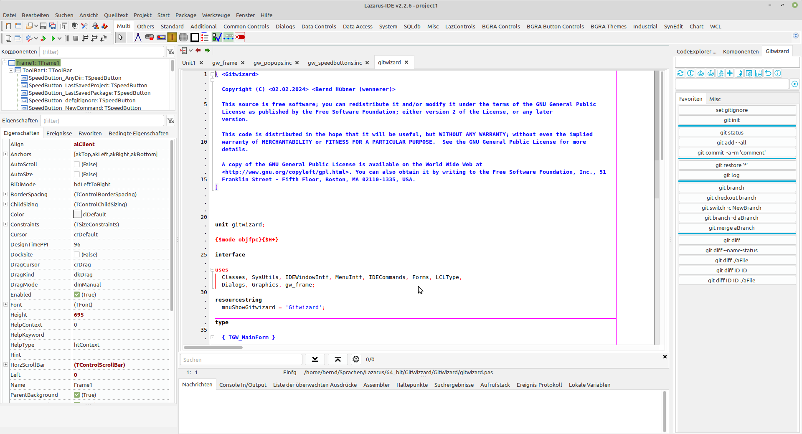

A git integration into the Lazarus IDE   
The basic idea of the programme is that the Lazarus user can create small script files with git commands and then execute them using GitWizard.    
As soon as the package is installed, the GitWizard item is located in the Tools menu. Click on this to open the window.   
If you want you can dock the window in the Lazarus IDE   
First click the Options button and enter an editor (e.g. xed, gedit, notepad, etc.) with which you can open the scripts or gitignore.  
If you want to use the scripts I used, click on the penultimate button (Restore backup).  
All command buttons have a pop-up (click with right mouse button)   
Attention! The restore button first deletes the command folder and then copies the scripts from the backup folder to the command folder.   
   
!  
